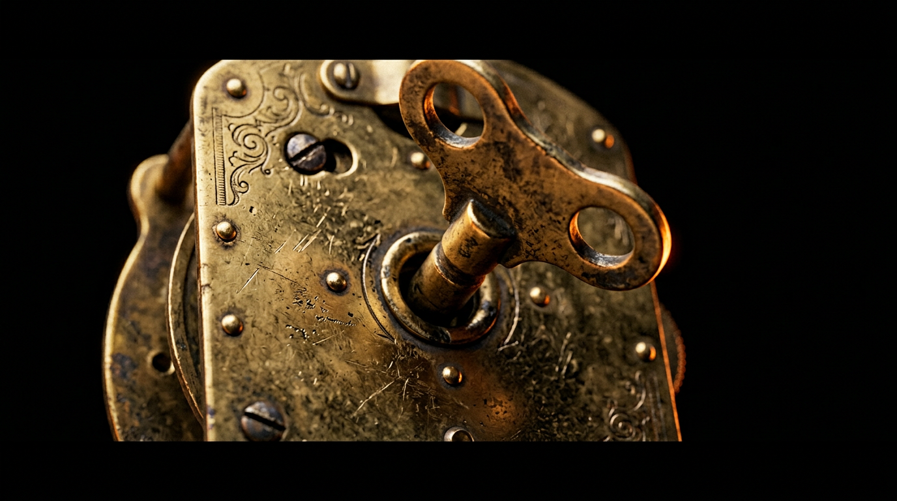
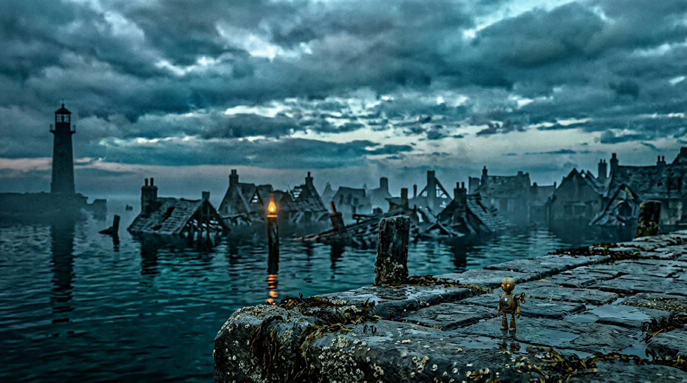
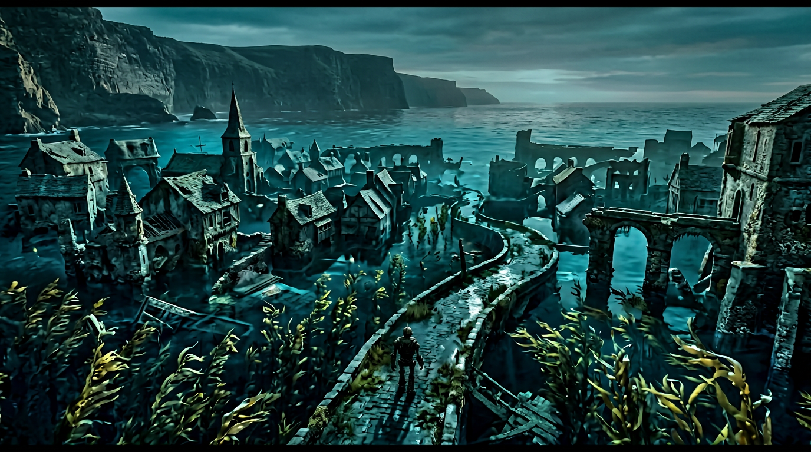
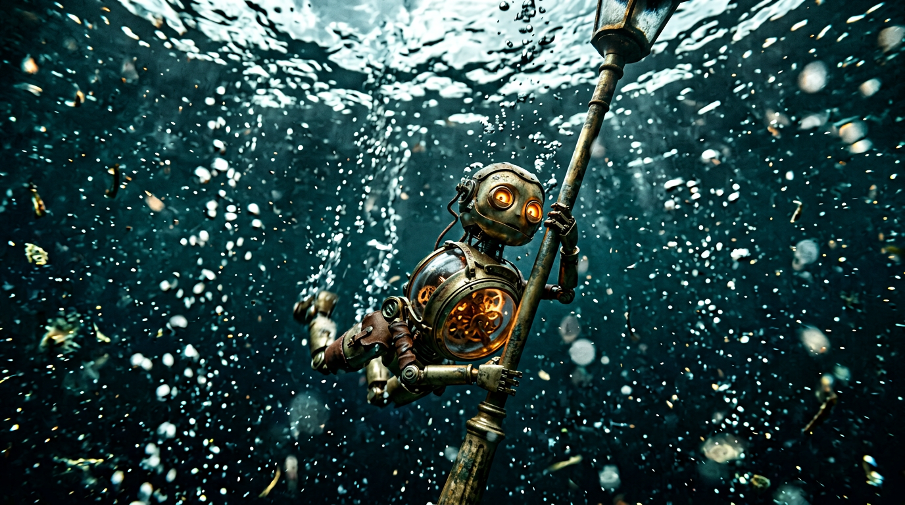
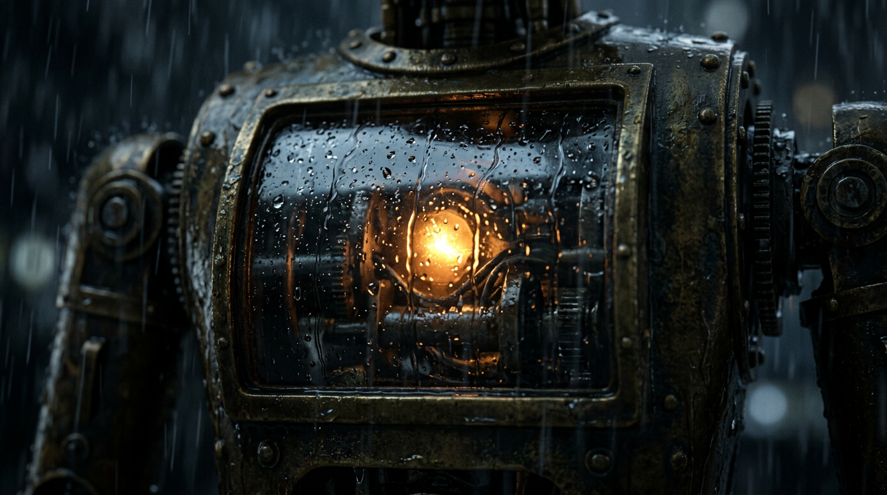
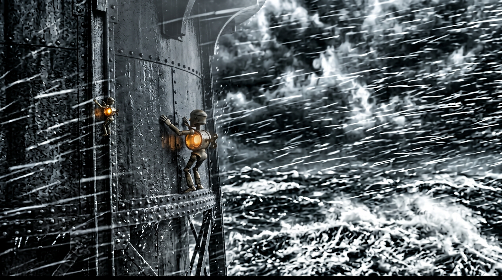
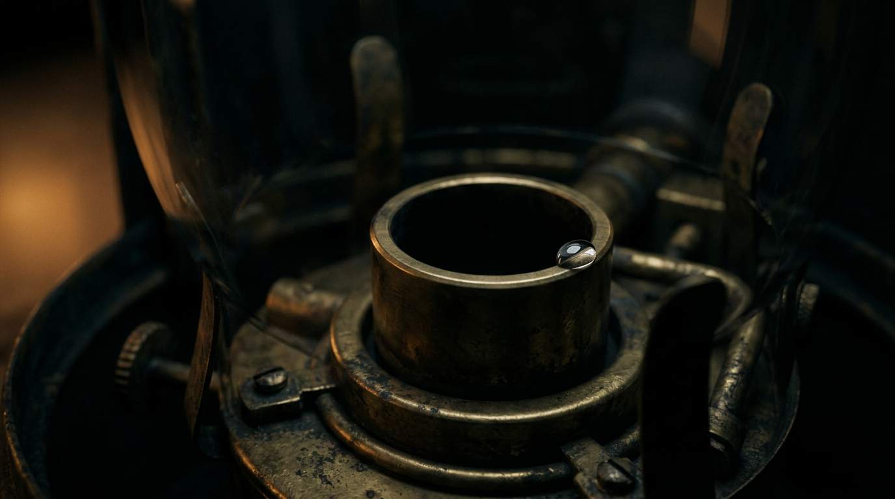
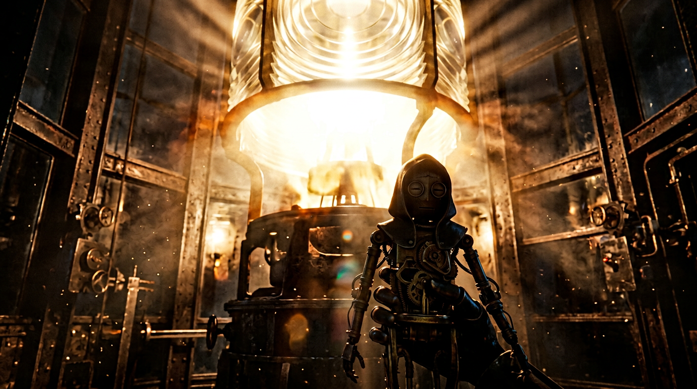
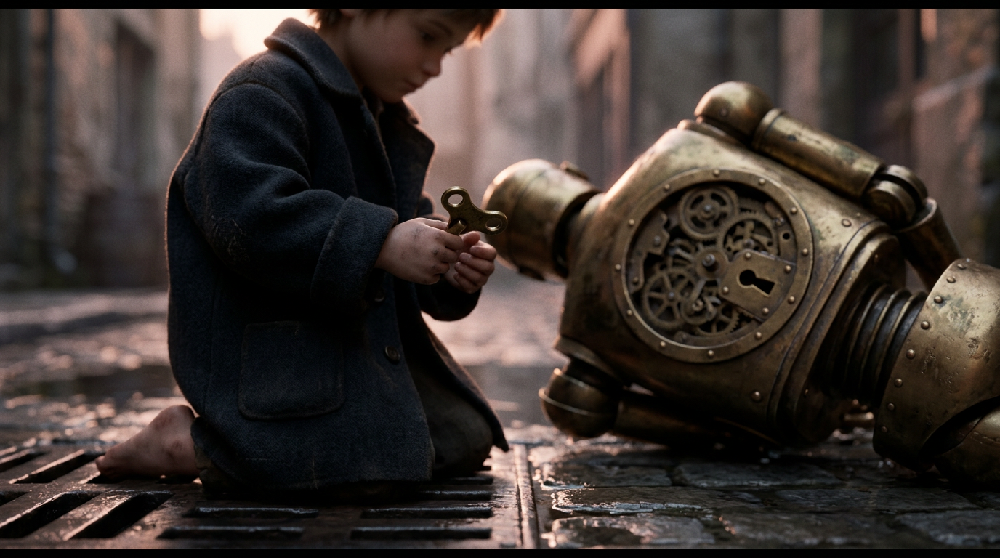

# STORYBOARD - NINETY-TWO TURNS

Stage 04 deliverable. 58 shots across 10 scenes, 302.0 s at 24 fps (frames 1-7248).

Coverage: every shot id in `02_SCREENPLAY/SHOT_LIST.json` has exactly one 18-field production specification in `MASTER_SHOT_PLAN.json`. Camera-only and blocking-only projections live in `CAMERA_PLAN.json` and `BLOCKING_PLAN.json`. Panel files are a representative subset of 9 reference frames, not full coverage.

**Master axis.** Master line of action: the sea and the returning ship sit FRAME RIGHT; the tower sits FRAME LEFT. WICK's journey runs frame RIGHT to LEFT. The climb runs vertically with the tower wall to the left. After the ignition the payoff looks back FRAME RIGHT to the sea. No shot crosses this axis without a neutral macro or POV buffer.

**Camera grammar.** 34 of 58 shots are static, held or locked-off; 24 carry motivated movement. The film's only whip-pan is SC06_SH002; the protected 8 s hold at SC09_SH001 is never covered.

## SC01 - THE WINDING

`00:00.000-00:32.000` · 32.0 s · The Winding Plaza - the quay, at the winding pillar · beat HOOK · emotion curiosity, then dread · gauge None→92

> Open mid-action on an unexplained mechanism. Establish that WICK is finite, that her refill has just failed, and put the number 92 on screen inside eight seconds. Withhold the world until second 14.

### SC01_SH001 · extreme macro · 100mm macro · `00:00.000-00:05.500` (5.5 s, f1-132)

- **Composition / camera:** centre-weighted macro; the key is the entire frame | height chest-height of a 40cm machine (macro) | angle level, dead-on | distance extreme macro ~10cm
- **Move:** locked-off. Motivation: nothing moves but the key, so the camera must not add motion.
- **Blocking:** WICK off-frame; only her back plate and the turning key.
- **Depth layers:** FG key bow / MG back plate seam / BG black void
- **Screen direction:** static; no travel
- **Lighting:** one warm practical raking the brass; everything else black | scene key: cold teal, one warm practical
- **Action:** Extreme macro. A brass winding key seated in a back plate. It turns - once, twice, three times. On the fourth turn the ratchet slips and the key overshoots with no bite.
- **Emotion:** curiosity · **Transition:** Cut to the chest drum. · **Sound:** Three dry ratchet clicks, close and intimate. Distant wind under. No music.

### SC01_SH002 · macro · 100mm macro · `00:05.500-00:09.000` (3.5 s, f133-216)

- **Composition / camera:** rule-of-thirds; the shearing tooth at an upper intersection | height chest macro | angle level | distance macro
- **Move:** very slight push-in. Motivation: the audience leans toward the failure.
- **Blocking:** coil inside the drum; tooth shears and falls out of frame.
- **Depth layers:** FG glass reflection / MG coiled spring / BG drum interior, dark
- **Screen direction:** static
- **Lighting:** amber internal glow on the coil; the ping reads as a flash | scene key: cold teal, one warm practical
- **Action:** Macro on the glass chest drum. Inside, the coil tightens - then a single spring tooth shears off, pings against the glass and falls out of frame. The needle swings upward, hesitates, sags, and settles on 92.
- **Emotion:** dread · **Transition:** Cut to a held static on the gauge. · **Sound:** A bright metallic ping on the shear, then a low sub thud as the needle settles. Silence under.

### SC01_SH003 · macro · 100mm macro · `00:09.000-00:14.000` (5.0 s, f217-336)

- **Composition / camera:** centred gauge; the number 92 dead-centre | height chest macro | angle level | distance macro
- **Move:** static. Motivation: the first true stillness lets the number land.
- **Blocking:** needle settles; trembles once; still.
- **Depth layers:** FG gauge glass / MG needle + 92 / BG out-of-focus amber lamp glow drifting
- **Screen direction:** static
- **Lighting:** soft amber defocus over cool brass | scene key: cold teal, one warm practical
- **Action:** Hold on the gauge. 92. The needle trembles once and is still. Out of focus, warm amber lamp light drifts across the glass.
- **Emotion:** dread, held · **Transition:** Pull back. · **Sound:** Wind. Distant water. Nothing else. The silence is the point.

### SC01_SH004 · extreme wide · 24mm · `00:14.000-00:22.000` (8.0 s, f337-528)

- **Composition / camera:** reveal: subject low-centre, vast negative space above | height rising from her eye height to a high crane | angle low to high in one move | distance macro to extreme wide
- **Move:** slow continuous crane back and up. Motivation: the world is the reveal; the move is the reveal.
- **Blocking:** WICK stands alone, tiny, on the quay.
- **Depth layers:** FG quay edge stone / MG WICK / BG drowned town, dusk sky, one burning lamp, tower on horizon frame L
- **Screen direction:** static frame; she is still
- **Lighting:** dusk teal; the single amber lamp is the only warm source | scene key: cold teal, one warm practical
- **Action:** Slow pull back and up. The frame opens out to reveal WICK - forty centimetres of aged brass - alone on a barnacled stone quay. Behind her, a drowned harbour town. One lamp still burns on a post. Dusk.
- **Emotion:** wonder, isolation · **Transition:** Cut to her eye height. · **Sound:** Harbour ambience swells in as we widen: water, wind through iron, no birds.

### SC01_SH005 · close-up · 50mm · `00:22.000-00:27.000` (5.0 s, f529-648)

- **Composition / camera:** close, head-centred; eyes on the top third | height her eye height (~0.35m) | angle level | distance close
- **Move:** handheld micro-drift. Motivation: a living, breathing (ticking) machine.
- **Blocking:** shutter eyes iris open; head drops to the chest gauge, then tilts up.
- **Depth layers:** FG none / MG head + chest top / BG soft dusk quay
- **Screen direction:** eyeline: gauge down, tower up/left
- **Lighting:** cool dusk with amber eye glow | scene key: cold teal, one warm practical
- **Action:** WICK's shutter eyes open - the apertures irising up from black. She looks down at her own chest gauge, and holds on what it says.
- **Emotion:** alert, assessing · **Transition:** Cut to her point of view. · **Sound:** Her clock motif, first statement: three thin notes on a single instrument. Wind.

### SC01_SH006 · POV wide · 35mm · `00:27.000-00:32.000` (5.0 s, f649-768)

- **Composition / camera:** her POV; tower small at the left-third horizon line | height her eye height | angle level | distance wide (her POV)
- **Move:** static. Motivation: it is her gaze, not a camera idea.
- **Blocking:** WICK off-frame (POV).
- **Depth layers:** FG water sheen / MG black harbour water / BG unlit tower frame L, bruised sky
- **Screen direction:** looks frame L
- **Lighting:** last dusk; tower a black silhouette | scene key: cold teal, one warm practical
- **Action:** Her point of view: the dark, unlit beacon tower on the horizon across black water. Hold. She does not move.
- **Emotion:** resolve forming · **Transition:** Hard cut to the pillar. · **Sound:** Wind. The clock motif does not resolve; it simply stops.

## SC02 - THE DEAD PILLAR

`00:32.000-01:05.000` · 33.0 s · The Winding Plaza - the pillar and the harbour horizon · beat STAKE · emotion dread hardening into resolve · gauge 92→92

> Make the cost of the failure concrete: the pillar is stripped and she cannot recharge. Establish the ship, the reef and the tower in a nine-second three-point eyeline, so the audience knows exactly what she is walking toward and what happens if she does not get there.

### SC02_SH001 · medium low · 35mm · `00:32.000-00:38.500` (6.5 s, f769-924)

- **Composition / camera:** low medium; the pillar looms over her, apex off-frame | height ankle-height of a human / her full height | angle low, tilting her small against the pillar | distance medium
- **Move:** static. Motivation: the habit is the point; no motion needed.
- **Blocking:** she backs to the pillar and seats herself - a daily, practised motion.
- **Depth layers:** FG pillar base barnacles / MG WICK / BG plaza, dusk
- **Screen direction:** static
- **Lighting:** dusk teal; pillar unlit | scene key: cold teal, one warm practical
- **Action:** WICK at the winding pillar, a brass column at the centre of the plaza. She backs up to it and raises herself onto the socket - a practised, habitual, daily motion.
- **Emotion:** routine · **Transition:** Cut to macro on the socket. · **Sound:** Her joints. The small click of alignment as she seats herself.

### SC02_SH002 · macro / insert · 100mm macro · `00:38.500-00:43.000` (4.5 s, f925-1032)

- **Composition / camera:** macro socket centred; the worn teeth on the lower third | height back height | angle level | distance macro
- **Move:** static. Motivation: the repetition of the failure is the content; the camera gives no help.
- **Blocking:** key enters, spins free; she withdraws; tries again; and again.
- **Depth layers:** FG key drive / MG stripped socket / BG brass
- **Screen direction:** static
- **Lighting:** raking warm key-light on worn teeth | scene key: cold teal, one warm practical
- **Action:** Macro on the socket: stripped, the teeth worn away. The key enters and spins free with no bite. She withdraws and tries again. And again.
- **Emotion:** confusion to alarm · **Transition:** Cut wide to the horizon. · **Sound:** Three hollow spins with no ratchet underneath. On the third, absolute silence.

### SC02_SH003 · extreme wide · 200mm · `00:43.000-00:49.000` (6.0 s, f1033-1176)

- **Composition / camera:** extreme long lens; the running light a point on the right-third | height her eye height | angle level | distance very long (200mm) - the sea frame RIGHT
- **Move:** held. Motivation: the ship is distant and slow; motion would falsify it.
- **Blocking:** off-frame (her eyeline).
- **Depth layers:** FG none / MG haze / BG sea frame R, reef line, single amber light
- **Screen direction:** looks frame R
- **Lighting:** storm-grey sea; one amber point | scene key: cold teal, one warm practical
- **Action:** Wide over the harbour to the horizon. A single amber running light, low on the water, moving toward the reef line.
- **Emotion:** stake · **Transition:** Cut to reverse. · **Sound:** Wind. A distant bell buoy, slow and irregular. First statement of the ship's motif: two descending notes.

### SC02_SH004 · wide · 18mm · `00:49.000-00:55.000` (6.0 s, f1177-1320)

- **Composition / camera:** wide; tower leans from the left edge, sky dominant | height waterline (very low) | angle low, leaning | distance wide
- **Move:** static. Motivation: let the height be felt, not pushed.
- **Blocking:** off-frame.
- **Depth layers:** FG water edge / MG tower base / BG tower full height frame L, bruised sky
- **Screen direction:** the destination frame L
- **Lighting:** storm slate rim | scene key: cold teal, one warm practical
- **Action:** Reverse, from the waterline: the beacon tower, black against a bruised sky, unlit.
- **Emotion:** foreboding · **Transition:** Cut back to her. · **Sound:** Wind rising. Iron groaning under load.

### SC02_SH005 · close-up · 85mm · `00:55.000-01:00.000` (5.0 s, f1321-1440)

- **Composition / camera:** close; gauge lower-third, tower reflected in the lenses above | height chest height | angle level | distance close
- **Move:** static. Motivation: the reflection completes the three-point eyeline.
- **Blocking:** she holds still; the tower lives in her lenses.
- **Depth layers:** FG chest brass / MG gauge 92 / BG tower reflection in the shutter lenses
- **Screen direction:** reflection frame L
- **Lighting:** amber eye/chest glow over cool brass | scene key: cold teal, one warm practical
- **Action:** Close on WICK's chest. The gauge reads 92. The dark tower is reflected in her shutter lenses.
- **Emotion:** calculating · **Transition:** Cut to the pole. · **Sound:** Her clock motif, second statement - noticeably faster than the first.

### SC02_SH006 · medium · 40mm · `01:00.000-01:05.000` (5.0 s, f1441-1560)

- **Composition / camera:** medium profile; she crosses and exits frame L on the footfall | height her eye height | angle level profile | distance medium
- **Move:** static; she provides the motion and exits frame L. Motivation: cut on the step, not after it.
- **Blocking:** lifts the pole, shoulders it, takes one step frame L.
- **Depth layers:** FG stone / MG WICK + pole / BG plaza left
- **Screen direction:** travels frame L (journey axis)
- **Lighting:** dusk; last warm lamp behind | scene key: cold teal, one warm practical
- **Action:** She reaches down and lifts the lamp-pole from the stone. It is taller than she is. She sets it against her shoulder, takes one step toward the tower.
- **Emotion:** decided · **Transition:** Cut on the footfall. · **Sound:** The pole scraping stone. One footfall. Then the score's first forward motion underneath.

## SC03 - SETTING OUT

`01:05.000-01:32.000` · 27.0 s · The Winding Plaza - across the quay toward the flooded street · beat DEPARTURE · emotion wonder, underpinned by a counting dread · gauge 92→84

> Teach the film's grammar: movement spends turns, and the gauge is the receipt. Also the only genuinely beautiful, calm passage in the film - it earns the storm and gives the audience something to grieve for.

### SC03_SH001 · tracking medium · 40mm · `01:05.000-01:11.000` (6.0 s, f1561-1704)

- **Composition / camera:** lateral tracking; gauge held in frame as she moves R->L | height her eye height | angle level profile | distance medium tracking
- **Move:** lateral dolly at her height, matching her stride. Motivation: keep the gauge legible while she travels.
- **Blocking:** walks frame L; gauge ticks with each stride.
- **Depth layers:** FG passing bollards / MG WICK + pole / BG quay
- **Screen direction:** travels frame L
- **Lighting:** dusk teal; warm practicals sparse | scene key: cold teal, one warm practical
- **Action:** Lateral tracking. WICK crosses the plaza. With every stride the gauge ticks down: 92, 90, 88.
- **Emotion:** purpose under dread · **Transition:** Cut to gauge insert. · **Sound:** Ratchet ticks locked to her footfalls. This is the film's central sound idea and it starts here.

### SC03_SH002 · insert · 100mm macro · `01:11.000-01:16.000` (5.0 s, f1705-1824)

- **Composition / camera:** centred insert; identical gauge framing to SC01_SH003 | height chest macro | angle level | distance macro
- **Move:** static. Motivation: locked insert grammar.
- **Blocking:** needle steps 88->86.
- **Depth layers:** FG gauge glass / MG needle / BG brass
- **Screen direction:** static
- **Lighting:** soft amber on the dial | scene key: cold teal, one warm practical
- **Action:** Insert on the gauge. 88 to 86. The needle moves in discrete, audible steps rather than smoothly.
- **Emotion:** counting dread · **Transition:** Cut wide. · **Sound:** Two ticks, loud and dry, with nothing under them.

### SC03_SH003 · extreme wide · 24mm · `01:16.000-01:23.000` (7.0 s, f1825-1992)

- **Composition / camera:** high crane; the drowned town fills frame, WICK small lower-third | height high crane | angle high, slow push | distance extreme wide
- **Move:** high crane, slow push. Motivation: the beauty pass is earned by height and patience.
- **Blocking:** walks away from camera, small.
- **Depth layers:** FG kelp, shallows / MG submerged rooftops / BG drowned harbour
- **Screen direction:** away / frame L
- **Lighting:** the film's one warm, calm light | scene key: cold teal, one warm practical
- **Action:** Wide. The drowned harbour in full: barnacled arches, kelp swaying in the shallows, rooftops under black water. Beautiful, and completely empty.
- **Emotion:** wonder · **Transition:** Cut to the lamp posts. · **Sound:** The music opens out: strings, warm, the only major-key passage in the film.

### SC03_SH004 · tracking medium · 40mm · `01:23.000-01:28.000` (5.0 s, f1993-2112)

- **Composition / camera:** medium tracking; lamp posts strobe the foreground | height her eye height | angle level | distance medium tracking
- **Move:** tracking; foreground poles strobe past. Motivation: rhythm and the row of dead lamps.
- **Blocking:** walks frame L past dead lamps; one burns behind.
- **Depth layers:** FG strobing lamp posts / MG WICK / BG dark row, one amber lamp
- **Screen direction:** travels frame L
- **Lighting:** cool with a single warm lamp behind | scene key: cold teal, one warm practical
- **Action:** She passes a row of harbour lamp posts, all dead. She does not stop. Behind her, the one lamp that still burns.
- **Emotion:** quiet grief · **Transition:** Cut to the water's edge. · **Sound:** The clock motif continues under the strings. Wind.

### SC03_SH005 · over-shoulder · 35mm · `01:28.000-01:32.000` (4.0 s, f2113-2208)

- **Composition / camera:** over-shoulder; black water ahead fills the frame | height her eye height | angle over-shoulder | distance medium
- **Move:** static hold on the water. Motivation: the water is the next obstacle; let it be seen.
- **Blocking:** stops at the quay edge, back to camera.
- **Depth layers:** FG her shoulder / MG quay edge / BG black flooded street
- **Screen direction:** faces frame L
- **Lighting:** music cuts; water catches cold light | scene key: cold teal, one warm practical
- **Action:** Gauge reads 84. She reaches the edge of the plaza. Beyond it, the street is black water.
- **Emotion:** apprehension · **Transition:** Hard cut. · **Sound:** Music cuts out entirely. Water lapping at stone.

## SC04 - THE FLOODED STREET

`01:32.000-02:02.000` · 30.0 s · The Flooded Streets - a half-submerged lane · beat OBSTACLE_1 · emotion alarm · gauge 84→71

> First real obstacle and first near-failure. Water that is ankle-deep for us is a flood for her. Establish that the world is hostile to her specifically, and that a mistake is survivable but expensive.

### SC04_SH001 · wide low · 24mm · `01:32.000-01:37.000` (5.0 s, f2209-2328)

- **Composition / camera:** wide low; water fills the lower half, she at the right edge | height water level | angle low | distance wide
- **Move:** static. Motivation: the flood is the reveal.
- **Blocking:** stops at the lane edge.
- **Depth layers:** FG black water / MG submerged lane / BG shopfronts
- **Screen direction:** faces frame L
- **Lighting:** storm slate, flat cold | scene key: storm slate, deep teal, amber spark
- **Action:** Wide, low. The flooded lane. For a forty-centimetre machine this is a flood. She stops at the edge.
- **Emotion:** daunted · **Transition:** Cut to the stall. · **Sound:** Water. Wind funnelling between buildings.

### SC04_SH002 · medium · 50mm · `01:37.000-01:42.500` (5.5 s, f2329-2460)

- **Composition / camera:** tight at her height on the stall climb | height her height, handheld | angle level/slight low | distance medium-tight
- **Move:** handheld instability. Motivation: the effort should feel unstable.
- **Blocking:** grip, haul, grip up the stall.
- **Depth layers:** FG water sheeting / MG WICK on stall / BG lane
- **Screen direction:** climbs frame L/up
- **Lighting:** cold with her amber chest glow | scene key: storm slate, deep teal, amber spark
- **Action:** She climbs a submerged market stall. Grip, haul, grip. Water sheets off her. Gauge 84 to 80.
- **Emotion:** working hard · **Transition:** Cut to the railing. · **Sound:** Metal straining. Water sheeting off brass. The footfall ticks continue but are now irregular.

### SC04_SH003 · profile medium · 50mm · `01:42.500-01:47.000` (4.5 s, f2461-2568)

- **Composition / camera:** profile; the railing a hard horizontal line, she above it | height her height | angle level profile | distance medium
- **Move:** static profile; she crosses. Motivation: the line gives the traverse legibility.
- **Blocking:** hand-over-hand along the railing.
- **Depth layers:** FG raindrops on water / MG railing + WICK / BG lane
- **Screen direction:** travels frame L
- **Lighting:** first countable raindrops catch light | scene key: storm slate, deep teal, amber spark
- **Action:** Railing traverse, hand over hand. Rain begins - sparse first drops on the water. Gauge 80 to 77.
- **Emotion:** committed · **Transition:** Cut to the fall. · **Sound:** Rhythmic clicks. The first raindrops - distinct, countable.

### SC04_SH004 · underwater · 35mm · `01:47.000-01:53.000` (6.0 s, f2569-2712)

- **Composition / camera:** underwater; the bright surface as a ceiling above | height below the surface, looking up | angle up from below | distance medium
- **Move:** goes under with her. Motivation: the drop must be felt, not observed.
- **Blocking:** grip fails; she falls; bubbles rise.
- **Depth layers:** FG bubbles / MG WICK tumbling / BG bright water surface above
- **Screen direction:** down
- **Lighting:** muffled; surface a bright ceiling | scene key: storm slate, deep teal, amber spark
- **Action:** THE DROP. Her grip fails and she goes under. Bubbles. The gauge flickers, the needle stuttering. The surface becomes a bright ceiling above her.
- **Emotion:** alarm · **Transition:** Cut to low angle. · **Sound:** Everything muffles. A dull sub. Her clock motif distorted and slowing.

### SC04_SH005 · low underwater · 35mm · `01:53.000-01:58.000` (5.0 s, f2713-2832)

- **Composition / camera:** low underwater looking up at her amber eyes | height lane floor, looking up | angle up | distance medium
- **Move:** static low; she rises past. Motivation: her glow is the only warm thing in the murk.
- **Blocking:** plants feet, pushes up.
- **Depth layers:** FG murk / MG WICK rising, eyes glowing / BG surface light
- **Screen direction:** up
- **Lighting:** amber eye glow in teal murk | scene key: storm slate, deep teal, amber spark
- **Action:** Underwater, looking up. Her shutter eyes glow amber in the murk. She plants her feet on the lane floor and pushes.
- **Emotion:** recovering, angry · **Transition:** Cut to the surface break. · **Sound:** Muffled. Then the first audible catch of her spring - a small bright note under the murk.

### SC04_SH006 · tight medium · 50mm · `01:58.000-02:02.000` (4.0 s, f2833-2928)

- **Composition / camera:** tight low; she breaks the surface and hauls onto the coping | height coping level, low | angle low | distance tight medium
- **Move:** low and tight; water on the lens. Motivation: imperfect on purpose - she is damaged.
- **Blocking:** breaks surface, hauls onto coping, sparking.
- **Depth layers:** FG water on lens / MG WICK on coping / BG wall
- **Screen direction:** up / frame L
- **Lighting:** steam off brass; rain steady | scene key: storm slate, deep teal, amber spark
- **Action:** She breaks the surface and hauls herself onto a wall coping, sparking. Steam comes off her brass. Gauge 75 to 71.
- **Emotion:** shaken · **Transition:** Hard cut to the gantry. · **Sound:** The surface break, loud. Rain now steady and continuous.

## SC05 - THE GANTRY

`02:02.000-02:38.000` · 36.0 s · The Flooded Streets - the gantry walkway · beat OBSTACLE_2_AND_LOSS · emotion loss, then tenderness, then a colder determination · gauge 71→58

> Midpoint reversal. She loses her tool, and takes the spark into her own body to protect it - so from here the thing she is saving is the thing consuming her. Establish the film's signature image: an amber spark behind rain-streaked glass.

### SC05_SH001 · wide · 28mm · `02:02.000-02:07.000` (5.0 s, f2929-3048)

- **Composition / camera:** wide; the gantry a diagonal across frame, tower at its far (L) end | height gantry level, low | angle level wide | distance wide
- **Move:** static. Motivation: the destination must stay visible during the obstacle.
- **Blocking:** steps onto the gantry.
- **Depth layers:** FG rain / MG gantry / BG tower at frame L end
- **Screen direction:** crosses frame L
- **Lighting:** storm slate; wind from camera-R | scene key: storm slate, deep teal, amber spark
- **Action:** Wide. The gantry walkway spans the lane, rusted and swaying in the rising wind. She steps onto it.
- **Emotion:** wary · **Transition:** Cut to midway. · **Sound:** Wind up sharply. Iron creaking under load.

### SC05_SH002 · medium low · 35mm · `02:07.000-02:12.500` (5.5 s, f3049-3180)

- **Composition / camera:** medium low; wind from camera-R bends the rain horizontal | height her height | angle low | distance medium
- **Move:** static; the gust supplies motion. Motivation: brace against, don't chase.
- **Blocking:** braces, pole horizontal.
- **Depth layers:** FG horizontal rain / MG WICK braced / BG gantry
- **Screen direction:** holds frame L against wind R
- **Lighting:** cold steel; spark glow | scene key: storm slate, deep teal, amber spark
- **Action:** Midway. A gust hits. She braces with the pole held horizontal. Gauge 71 to 68.
- **Emotion:** strained · **Transition:** Cut to the pole. · **Sound:** The gust as a solid wall of sound, not a whoosh.

### SC05_SH003 · medium, then hold on water · 50mm · `02:12.500-02:17.000` (4.5 s, f3181-3288)

- **Composition / camera:** follow the pole out of frame; hold on empty water | height gantry level | angle level | distance medium
- **Move:** follows the pole out of frame, then holds on the water. Motivation: the loss is the subject; the absence is held.
- **Blocking:** gust takes the pole; she reaches for nothing.
- **Depth layers:** FG rain / MG pole spinning away / BG water where it lands
- **Screen direction:** pole exits; she is left frame R of centre
- **Lighting:** the hole in the sound matches the hole in the frame | scene key: storm slate, deep teal, amber spark
- **Action:** THE POLE GOES. A second gust takes the lamp-pole out of her grip. It spins away, strikes the water and is gone.
- **Emotion:** startled, loss · **Transition:** Cut back to her. · **Sound:** The pole clattering on iron, one splash, then nothing. A hole opens in the sound.

### SC05_SH004 · close-up · 85mm · `02:17.000-02:23.000` (6.0 s, f3289-3432)

- **Composition / camera:** close static; the whole decision in one frame | height her height | angle level | distance close
- **Move:** static, no cut. Motivation: the stillness IS the beat; wind drops for it.
- **Blocking:** looks at empty hand; looks at the tower; decides.
- **Depth layers:** FG none / MG WICK / BG storm soft-focus
- **Screen direction:** hand, then frame L
- **Lighting:** the only quiet in the storm | scene key: storm slate, deep teal, amber spark
- **Action:** She stands without it. Looks at her empty hand. Looks at the tower. Decides. The wind drops for one beat.
- **Emotion:** grief to resolve · **Transition:** Cut to the chest. · **Sound:** The wind drops for exactly one beat. The only quiet in the storm.

### SC05_SH005 · macro · 100mm macro · `02:23.000-02:29.000` (6.0 s, f3433-3576)

- **Composition / camera:** macro; the signature image - amber spark behind rain-streaked glass | height chest macro | angle level | distance macro
- **Move:** static. Motivation: protect the image; let it be looked at.
- **Blocking:** opens the chest drum; the spark glows; she seals the glass.
- **Depth layers:** FG rain streaks on glass / MG amber spark / BG chest interior
- **Screen direction:** static
- **Lighting:** the spark is the warmest thing in the scene | scene key: storm slate, deep teal, amber spark
- **Action:** She opens her chest drum. Inside: a live spark, taken from the last burning harbour lamp. She closes the glass against the rain.
- **Emotion:** tenderness · **Transition:** Cut to movement. · **Sound:** The glass sealing. A small warm hum begins - the spark's own tone, which persists until SC08_SH003.

### SC05_SH006 · tracking medium · 40mm · `02:29.000-02:34.000` (5.0 s, f3577-3696)

- **Composition / camera:** tracking; the glow the brightest element | height her height | angle level | distance medium tracking
- **Move:** tracking; the glow leads the frame. Motivation: the thing she shields is the light source.
- **Blocking:** moves frame L, one arm across the chest.
- **Depth layers:** FG rain / MG WICK shielding glow / BG gantry
- **Screen direction:** travels frame L
- **Lighting:** amber glow vs cold steel | scene key: storm slate, deep teal, amber spark
- **Action:** She moves on, one arm now curled across her chest to shield the glass. The spark is drawing power as she walks. Gauge 64 to 60.
- **Emotion:** burdened · **Transition:** Cut to gauge insert. · **Sound:** The spark hum plus a new, slower tick layered over the footfall ticks - the drain is audible.

### SC05_SH007 · insert with rack focus · 100mm macro · `02:34.000-02:38.000` (4.0 s, f3697-3792)

- **Composition / camera:** macro gauge, then rack to the door - one move | height chest macro | angle level | distance macro then deep
- **Move:** rack focus gauge->door. Motivation: hand SC06 its first image in a single move.
- **Blocking:** off-frame walking.
- **Depth layers:** FG needle 60->58 / MG gauge / BG tower door ahead through rain
- **Screen direction:** faces frame L
- **Lighting:** rain; door dark | scene key: storm slate, deep teal, amber spark
- **Action:** Gauge insert: 60 to 58. Rack focus past the needle to the tower door ahead through the rain.
- **Emotion:** determination · **Transition:** Cut on the rack. · **Sound:** Rain. The spark hum continues.

## SC06 - THE TOWER BASE

`02:38.000-03:06.000` · 28.0 s · The Tidelight Tower - the door and the lower stair · beat OBSTACLE_3 · emotion foreboding · gauge 58→31

> The most expensive single action in the film, and the moment the needle enters the red arc. Then take the easy route away: the stair is gone, so the only way up is outside.

### SC06_SH001 · wide low · 24mm · `02:38.000-02:43.000` (5.0 s, f3793-3912)

- **Composition / camera:** wide low; the swollen door fills the frame above her | height ground, looking up | angle low | distance wide
- **Move:** static. Motivation: compress her against the bottom edge.
- **Blocking:** stands at the foot of the door, small.
- **Depth layers:** FG barnacled door base / MG WICK / BG door towering
- **Screen direction:** faces frame L (the door)
- **Lighting:** rain on iron; tower humming | scene key: near-monochrome, high contrast, storm-white rim
- **Action:** The tower door: iron, swollen, barnacled. She stands at its foot. She is very small against it.
- **Emotion:** daunted · **Transition:** Cut to the effort. · **Sound:** Rain on iron. The tower itself humming in the wind.

### SC06_SH002 · tight medium to insert · 50mm · `02:43.000-02:50.000` (7.0 s, f3913-4080)

- **Composition / camera:** tight on the effort, then whip to the gauge | height her height | angle level tight | distance tight medium
- **Move:** tight, then a whip to the gauge. Motivation: the single fast move of the film is the cost.
- **Blocking:** shoulder to the plate; it gives; she resets; it swings.
- **Depth layers:** FG iron / MG WICK straining / BG door
- **Screen direction:** pushes frame L
- **Lighting:** her glow + cold iron | scene key: near-monochrome, high contrast, storm-white rim
- **Action:** She levers it. Shoulder against the plate. It gives an inch. She resets and pushes again. It swings. Gauge falls fast: 58 to 49 to 40.
- **Emotion:** maximum effort · **Transition:** Cut to the gauge. · **Sound:** Iron shrieking. Her spring straining - a sound not used anywhere else.

### SC06_SH003 · insert · 100mm macro · `02:50.000-02:55.000` (5.0 s, f4081-4200)

- **Composition / camera:** centred insert; the needle crossing into the red arc | height chest macro | angle level | distance macro
- **Move:** dead still. Motivation: the quietest moment in the film.
- **Blocking:** needle crosses into the red arc.
- **Depth layers:** FG gauge glass / MG needle in red / BG brass
- **Screen direction:** static
- **Lighting:** everything drops out except needle friction | scene key: near-monochrome, high contrast, storm-white rim
- **Action:** Gauge insert. The needle crosses into the RED ARC of the dial. Hold.
- **Emotion:** foreboding · **Transition:** Cut to the interior. · **Sound:** Everything drops out except the tiny friction of the needle. The quietest moment in the film.

### SC06_SH004 · interior tilt-up · 18mm · `02:55.000-03:01.000` (6.0 s, f4201-4344)

- **Composition / camera:** interior; she enters low, the stair tilts up out of frame | height her height, tilting up | angle low to vertical tilt | distance wide interior
- **Move:** she enters; tilt up the stair, and keep tilting. Motivation: the tower's height in one move.
- **Blocking:** steps in; her glow lights the stair.
- **Depth layers:** FG door frame / MG spiral stair / BG dark stairwell, water on wall
- **Screen direction:** up
- **Lighting:** her glow is the ONLY light | scene key: near-monochrome, high contrast, storm-white rim
- **Action:** Interior. She steps in. A spiral stair rises into darkness, lit only by her own amber glow. Water runs down the inside of the wall.
- **Emotion:** apprehension · **Transition:** Cut to the top of the stair. · **Sound:** Her footsteps echo. Reverb opens up hard the moment she crosses the threshold.

### SC06_SH005 · POV then reverse · 35mm · `03:01.000-03:06.000` (5.0 s, f4345-4464)

- **Composition / camera:** POV across the gap, then back to her | height her height | angle level | distance medium
- **Move:** POV then reverse, two angles, no motion. Motivation: the gap is the information.
- **Blocking:** at the broken stair edge.
- **Depth layers:** FG broken iron / MG the gap / BG storm through the breach
- **Screen direction:** POV across, then to her
- **Lighting:** storm light through the breach | scene key: near-monochrome, high contrast, storm-white rim
- **Action:** The stair ends. A gap. Broken iron hanging. Beyond it, the wall - and through a breach, the storm outside. Gauge 35 to 31.
- **Emotion:** understanding · **Transition:** Cut to the exterior. · **Sound:** Wind coming through the breach. The reverb narrows.

## SC07 - THE CLIMB

`03:06.000-03:48.000` · 42.0 s · The Tidelight Tower - exterior riveted plating · beat ESCALATION_PEAK · emotion desperation, then a single moment of recognition · gauge 31→6

> Longest scene and the escalation peak. The rig itself degrades as the spring weakens, so the animation carries the information rather than the plot. Return the lamp-pole as a brace so the earlier loss pays off mechanically, not sentimentally.

### SC07_SH001 · extreme wide · 24mm · `03:06.000-03:11.500` (5.5 s, f4465-4596)

- **Composition / camera:** extreme wide; the tower a vertical line, sea white far below | height exterior, wide | angle level wide | distance extreme wide
- **Move:** static. Motivation: she is a speck on a vertical; scale is the shot.
- **Blocking:** flattens against the iron as the gale hits.
- **Depth layers:** FG gale rain / MG tower plating / BG white sea far below
- **Screen direction:** on the wall; climb begins up/left
- **Lighting:** storm-white rim | scene key: near-monochrome, high contrast, storm-white rim
- **Action:** She goes out through the breach onto the riveted plating. The gale hits her flat. She presses herself against the iron. Gauge 31 to 28.
- **Emotion:** exposed · **Transition:** Cut to the collapse. · **Sound:** The gale at full volume. Rain horizontal.

### SC07_SH002 · follow then hold · 50mm · `03:11.500-03:17.000` (5.5 s, f4597-4728)

- **Composition / camera:** follow the iron down, hold on empty air | height exterior | angle level then down | distance medium
- **Move:** follows the stair section down out of frame; holds on the void. Motivation: the last easy option leaves.
- **Blocking:** watches it go.
- **Depth layers:** FG rain / MG falling iron / BG empty air
- **Screen direction:** down
- **Lighting:** storm | scene key: near-monochrome, high contrast, storm-white rim
- **Action:** The remaining section of stair tears away from the tower and falls. She watches it go. Gauge 28 to 25.
- **Emotion:** no way back · **Transition:** Cut to the climb. · **Sound:** The crash, delayed and far below. Then wind.

### SC07_SH003 · rising track · 35mm · `03:17.000-03:25.000` (8.0 s, f4729-4920)

- **Composition / camera:** rising track; the horizon progressively tilts off-level | height matching her ascent | angle level but horizon tilting | distance medium
- **Move:** slow rising track matched to her climb. Motivation: height felt, not shown.
- **Blocking:** hand over hand on rivets.
- **Depth layers:** FG rivets / MG WICK climbing / BG tilting horizon
- **Screen direction:** up
- **Lighting:** storm rim; her glow | scene key: near-monochrome, high contrast, storm-white rim
- **Action:** The climb. Hand over hand on rivets. Rain. The horizon tilts as she gains height. Gauge 25 to 22.
- **Emotion:** working, holding · **Transition:** Cut to the grip loss. · **Sound:** Grab, strain, grab. Her gait rhythm now audibly irregular - the pattern established in SC04_SH002 continues to degrade.

### SC07_SH004 · long lens down · 135mm · `03:25.000-03:31.000` (6.0 s, f4921-5064)

- **Composition / camera:** long lens straight down the drop | height her hand, looking down | angle down | distance long lens down
- **Move:** reveal the drop with a long lens. Motivation: the height is the danger.
- **Blocking:** peeled off; swings on one arm.
- **Depth layers:** FG her hand on a rivet / MG the drop / BG water far below
- **Screen direction:** down
- **Lighting:** storm | scene key: near-monochrome, high contrast, storm-white rim
- **Action:** GRIP LOSS. A gust peels her off the iron. She swings on one arm over the drop. Gauge 22 to 20.
- **Emotion:** real danger · **Transition:** Cut to her free hand. · **Sound:** One long metallic scream from the shoulder joint. Music out entirely.

### SC07_SH005 · insert · 85mm · `03:31.000-03:36.000` (5.0 s, f5065-5184)

- **Composition / camera:** insert: the wedged pole, then her hand closing on it | height her reach | angle level insert | distance insert
- **Move:** insert then her hand - two frames, no exposition. Motivation: the earlier loss pays off mechanically.
- **Blocking:** free hand finds the wedged pole; closes on it.
- **Depth layers:** FG rain / MG lamp-pole wedged in ironwork / BG iron
- **Screen direction:** reach
- **Lighting:** a single bright note returns | scene key: near-monochrome, high contrast, storm-white rim
- **Action:** Her free hand closes on something: the lamp-pole, wedged in the ironwork. It came up the tower with the storm.
- **Emotion:** astonished · **Transition:** Cut to the haul. · **Sound:** A single bright note. The score returns, one instrument only.

### SC07_SH006 · tight medium · 50mm · `03:36.000-03:41.000` (5.0 s, f5185-5304)

- **Composition / camera:** tight on the haul; the gauge kept in the corner of frame | height her height | angle level tight | distance tight medium
- **Move:** tight; the gauge rides the corner. Motivation: the cost must be visible during the win.
- **Blocking:** uses the pole as a brace; hauls.
- **Depth layers:** FG pole brace / MG WICK hauling / BG iron; gauge corner
- **Screen direction:** up
- **Lighting:** storm rim | scene key: near-monochrome, high contrast, storm-white rim
- **Action:** She uses the pole as a brace and hauls herself back onto the iron. Gauge 20 to 14.
- **Emotion:** spent · **Transition:** Cut to the last stretch. · **Sound:** The strain. Her clock motif stuttering - now audibly skipping a note.

### SC07_SH007 · abstract tight · 85mm · `03:41.000-03:45.000` (4.0 s, f5305-5400)

- **Composition / camera:** abstract tight: brass, rivets, rain - the world reduced | height her hands | angle tight | distance very tight
- **Move:** very tight, almost abstract. Motivation: hold on the broken motion, don't cover it.
- **Blocking:** limbs stutter; drags herself.
- **Depth layers:** FG brass / MG rivets + hands / BG rain
- **Screen direction:** up
- **Lighting:** near-monochrome | scene key: near-monochrome, high contrast, storm-white rim
- **Action:** The last stretch. Her limbs stutter. The gait breaks down entirely - she is dragging herself upward. Gauge 14 to 9.
- **Emotion:** failing · **Transition:** Cut to the rail. · **Sound:** The mechanism audibly failing. Metal fatigue. The clock motif has stopped being a melody.

### SC07_SH008 · medium, held · 35mm · `03:45.000-03:48.000` (3.0 s, f5401-5472)

- **Composition / camera:** medium held; she collapses over the rail into the lee | height gallery level | angle level | distance medium, held
- **Move:** she collapses into frame; hold. Motivation: let her be still before cutting.
- **Blocking:** pulls herself over the rail; collapses.
- **Depth layers:** FG rail / MG WICK collapsed / BG burner door ahead
- **Screen direction:** into the lee
- **Lighting:** gale drops inside the lee | scene key: near-monochrome, high contrast, storm-white rim
- **Action:** She reaches the gallery rail and pulls herself over, collapsing into the lee. Gauge 9 to 6. The burner chamber door is ahead.
- **Emotion:** barely functional · **Transition:** Cut to the chamber. · **Sound:** The gale drops sharply as she gets into the lee of the gallery.

## SC08 - THE BURNER

`03:48.000-04:22.000` · 34.0 s · The Tidelight Tower - the burner chamber · beat CLIMAX_AND_TWIST · emotion recognition, sacrifice, awe · gauge 6→0

> Climax and twist. The burner has no wick, no oil and no flint - only a socket the exact diameter of a mainspring. The reveal is played as a locked-off static shot in silence. The sacrifice must be mechanical and honest, not magical.

### SC08_SH001 · wide · 18mm · `03:48.000-03:53.000` (5.0 s, f5473-5592)

- **Composition / camera:** wide; she is tiny in an enormous brass room | height chamber floor, wide | angle level wide | distance wide
- **Move:** static. Motivation: scale contrast is the whole shot.
- **Blocking:** at the foot of the burner, tiny.
- **Depth layers:** FG dark floor / MG burner mass / BG chamber, dripping glass roof
- **Screen direction:** faces the burner
- **Lighting:** her glow the only light | scene key: black to full amber
- **Action:** Interior, the burner chamber. Cold, enormous brass. Her glow is the only light in it. She is tiny.
- **Emotion:** awed, exhausted · **Transition:** Cut to the ascent. · **Sound:** The storm reduced to a murmur outside. Water dripping.

### SC08_SH002 · close · 85mm · `03:53.000-03:58.500` (5.5 s, f5593-5724)

- **Composition / camera:** close following her hands up the last rungs | height her reach | angle level close | distance close
- **Move:** close, following the hands, unhurried. Motivation: it is not an action beat.
- **Blocking:** climbs; opens the chest; lifts the spark out.
- **Depth layers:** FG rungs / MG hands + spark / BG burner
- **Screen direction:** up to the burner
- **Lighting:** exposed spark glow | scene key: black to full amber
- **Action:** She climbs the last few rungs to the burner, opens her chest and lifts the spark out. Gauge 6 to 3.
- **Emotion:** careful, hopeful · **Transition:** Cut to the attempt. · **Sound:** The spark's hum, now exposed and fragile without the glass around it.

### SC08_SH003 · tight · 100mm macro · `03:58.500-04:03.000` (4.5 s, f5725-5832)

- **Composition / camera:** tight on the spark and the cold brass; the gap is the subject | height burner level | angle level tight | distance tight
- **Move:** static tight. Motivation: the gap between spark and brass is the point.
- **Blocking:** offers the spark; nothing catches; tries again.
- **Depth layers:** FG spark / MG cold brass / BG burner heart
- **Screen direction:** reaches
- **Lighting:** fragile glow on dead brass | scene key: black to full amber
- **Action:** She offers the spark to the burner. Nothing catches. She repositions and tries again. Nothing.
- **Emotion:** confused, afraid · **Transition:** Cut to the reveal. · **Sound:** The hum, then silence. No catch. No click. Nothing.

### SC08_SH004 · static insert · 100mm macro · `04:03.000-04:08.000` (5.0 s, f5833-5952)

- **Composition / camera:** locked-off static insert of the socket; no movement, no help | height burner heart | angle level | distance static insert
- **Move:** locked-off, no movement, no music. Motivation: the most important shot must not be decorated.
- **Blocking:** off-frame.
- **Depth layers:** FG none / MG the socket: no wick, no oil, no flint / BG brass
- **Screen direction:** static
- **Lighting:** absolute; one water drop | scene key: black to full amber
- **Action:** THE REVEAL. A static shot of the burner's heart: no wick, no oil, no flint. A socket. Cold brass. The exact diameter of a mainspring.
- **Emotion:** the reveal · **Transition:** Cut to her. · **Sound:** Absolute silence. One water drop.

### SC08_SH005 · close-up · 100mm · `04:08.000-04:13.000` (5.0 s, f5953-6072)

- **Composition / camera:** close-up on the shutter eyes; the aperture closes, then opens | height her head | angle level | distance close-up
- **Move:** static; the aperture is the only motion. Motivation: the whole decision without a cut.
- **Blocking:** looks at the socket; looks at her chest; decides.
- **Depth layers:** FG none / MG shutter eyes / BG brass soft
- **Screen direction:** socket, then chest
- **Lighting:** her glow low | scene key: black to full amber
- **Action:** On WICK. She looks at the socket. She looks at her own empty chest. A long beat - the whole decision, played without a cut.
- **Emotion:** understanding, at peace · **Transition:** Cut to the act. · **Sound:** Her clock motif, stated once, complete, on a single instrument. The only complete statement in the film.

### SC08_SH006 · macro · 100mm macro · `04:13.000-04:19.000` (6.0 s, f6073-6216)

- **Composition / camera:** macro; unspooling the spring into the socket, unhurried | height burner heart | angle level macro | distance macro
- **Move:** macro, unhurried. Motivation: the sacrifice is mechanical and must be watched.
- **Blocking:** unspools her spring; threads it into the socket; gauge 3->1->0.
- **Depth layers:** FG spring / MG socket / BG brass
- **Screen direction:** into the socket
- **Lighting:** the spring sings; the glow fades | scene key: black to full amber
- **Action:** She unspools her own mainspring and threads it into the socket. The gauge falls: 3, 2, 1. Then the ratchet engages.
- **Emotion:** spending herself · **Transition:** Cut to ignition. · **Sound:** The spring unspooling - a long, thin, singing sound. Then the ratchet engaging. Then her mechanism winding down to nothing.

### SC08_SH007 · silhouette to bloom · 50mm · `04:19.000-04:22.000` (3.0 s, f6217-6288)

- **Composition / camera:** her dark silhouette held as light blooms to white-gold | height chamber floor | angle level | distance medium
- **Move:** held on the silhouette; the bloom fills the frame without a cut. Motivation: the ignition is the payoff.
- **Blocking:** eyes go dark; the beacon ignites behind her.
- **Depth layers:** FG her silhouette / MG bloom / BG white-gold
- **Screen direction:** static
- **Lighting:** black to full amber - the largest contrast event | scene key: black to full amber
- **Action:** Her shutter eyes go dark. A beat of black. Then - IGNITION. The beacon floods the frame until it is white-gold.
- **Emotion:** sacrifice, awe · **Transition:** Cut to the exterior beam. · **Sound:** One beat of absolute silence. Then the ignition: a huge, warm, low bloom. The score in full, for the first and only time.

## SC09 - THE LIGHT

`04:22.000-04:42.000` · 20.0 s · The Tidelight Tower - the gallery and the water beyond · beat PAYOFF · emotion relief, then mourning · gauge 0→0

> Payoff and deliberate decompression. The ship turns, the reef slides past, dawn comes up. Held long and uncut so the relief lands physically, and so the contrast sets up the final scene.

### SC09_SH001 · extreme wide, held · 35mm · `04:22.000-04:30.000` (8.0 s, f6289-6480)

- **Composition / camera:** extreme wide held; the beam sweeps black water | height gallery/exterior, wide | angle level | distance extreme wide, held
- **Move:** locked wide, 8-second protected hold. Motivation: decompression; no coverage.
- **Blocking:** none.
- **Depth layers:** FG rain turning to light / MG the beam / BG black sea
- **Screen direction:** looks frame R to the sea
- **Lighting:** amber shaft in the dark | scene key: dawn rose-gold over wet stone
- **Action:** Exterior. The beam sweeps out across black water. Rain turns to light inside the shaft.
- **Emotion:** release · **Transition:** Cut to the ship. · **Sound:** The beacon's slow rotation. The sea. Score sustained, no melody.

### SC09_SH002 · extreme long lens · 300mm · `04:30.000-04:36.000` (6.0 s, f6481-6624)

- **Composition / camera:** extreme long lens; the ship tiny; its turn small and easy to miss | height sea level | angle level | distance extreme long lens (300mm)
- **Move:** held. Motivation: the turn is ponderous; motion would falsify it.
- **Blocking:** none (the ship).
- **Depth layers:** FG haze / MG running light / BG reef line sliding past
- **Screen direction:** the ship turns frame L (to harbour)
- **Lighting:** dawn edge on the water | scene key: dawn rose-gold over wet stone
- **Action:** Far out: the running light. It pauses. Then it turns - toward harbour. The reef line slides past behind it.
- **Emotion:** relief · **Transition:** Cut to dawn. · **Sound:** The bell buoy, now in rhythm with the beacon. The ship's two-note motif, resolved upward for the first time.

### SC09_SH003 · wide to slow push · 35mm · `04:36.000-04:42.000` (6.0 s, f6625-6768)

- **Composition / camera:** wide as the light dies, then a slow push to her silhouette | height chamber floor | angle level | distance wide to slow push
- **Move:** one continuous move: the light dies, the push finds her. Motivation: carry the mood across the cut.
- **Blocking:** her silhouette at the foot of the burner.
- **Depth layers:** FG dimming beam / MG chamber / BG dawn grey-gold
- **Screen direction:** to her
- **Lighting:** beacon dims as the dark goes; dawn | scene key: dawn rose-gold over wet stone
- **Action:** Dawn comes up grey-gold over the water. The beacon dims as the dark goes. Then: the chamber, dark again, and WICK's silhouette at the foot of the burner.
- **Emotion:** mourning · **Transition:** Cut to dawn interior. · **Sound:** The beacon winding down. The score thinning to nothing. Dawn birds - the first living sound in the film.

## SC10 - ONE TURN

`04:42.000-05:02.000` · 20.0 s · The Tidelight Tower - the burner chamber, dawn · beat RESOLUTION_AND_LOOP · emotion mourning resolving into hope · gauge 0→1

> Resolution and loop. The child gives her one turn - not a restoration, a beginning. The macro of the key turning mirrors the opening shot frame for frame so the film loops cleanly, and the last sound is the same click the film opened on.

### SC10_SH001 · medium, held · 50mm · `04:42.000-04:46.500` (4.5 s, f6769-6876)

- **Composition / camera:** medium held; her shell at the foot of the burner, held long | height floor, low | angle level | distance medium, held
- **Move:** static, held long enough to be uncomfortable. Motivation: do not soften it.
- **Blocking:** her shell, slumped, still holding the pole; gauge 0.
- **Depth layers:** FG wet iron / MG WICK shell / BG dawn chamber
- **Screen direction:** static
- **Lighting:** dawn rose-gold | scene key: dawn rose-gold over wet stone
- **Action:** Dawn light in the chamber. WICK's shell, slumped at the foot of the burner, still holding the pole. Gauge: 0.
- **Emotion:** mourning · **Transition:** Cut to the doorway. · **Sound:** Water dripping. Nothing else.

### SC10_SH002 · wide interior · 35mm · `04:46.500-04:51.000` (4.5 s, f6877-6984)

- **Composition / camera:** wide interior; the child a silhouette in the doorway | height interior, low | angle level | distance wide interior
- **Move:** static from inside the chamber. Motivation: the child is a silhouette, never resolved.
- **Blocking:** child enters, barefoot, backlit; sees her.
- **Depth layers:** FG chamber dark / MG doorway light / BG child silhouette
- **Screen direction:** child enters from the doorway
- **Lighting:** backlight and rim only | scene key: dawn rose-gold over wet stone
- **Action:** Footsteps. A child enters, backlit in the doorway - oversized coat, bare feet, small. Sees her.
- **Emotion:** quiet arrival · **Transition:** Cut to the hands. · **Sound:** Bare feet on wet iron.

### SC10_SH003 · close · 85mm · `04:51.000-04:55.500` (4.5 s, f6985-7092)

- **Composition / camera:** close on the child's hands and the key; the face out of focus | height kneel height | angle level close | distance close
- **Move:** static close on the hands. Motivation: the hesitation is the beat.
- **Blocking:** kneels; takes the key from her back; hesitates.
- **Depth layers:** FG hands / MG the key / BG her back, out of focus
- **Screen direction:** to her back
- **Lighting:** dawn rim on the key | scene key: dawn rose-gold over wet stone
- **Action:** The child kneels. Takes the key from WICK's back. Hesitates.
- **Emotion:** the hesitation · **Transition:** Cut to macro. · **Sound:** The key lifting out of the back plate - the same small metal sound as the opening.

### SC10_SH004 · extreme macro · 100mm macro · `04:55.500-04:59.000` (3.5 s, f7093-7176)

- **Composition / camera:** macro, identical framing to SC01_SH001, warmed to dawn - the loop | height back-plate macro | angle level, dead-on | distance extreme macro ~10cm
- **Move:** locked-off, identical to SC01_SH001. Motivation: the loop; one turn instead of four.
- **Blocking:** the key turns once; the ratchet catches.
- **Depth layers:** FG key bow / MG back plate / BG black void warmed
- **Screen direction:** static
- **Lighting:** dawn warm instead of dusk | scene key: dawn rose-gold over wet stone
- **Action:** MACRO - mirroring SC01_SH001 exactly. The key turns. One turn. The ratchet catches.
- **Emotion:** the single turn · **Transition:** Cut to the chest. · **Sound:** ONE click. Clean, loud in the silence.

### SC10_SH005 · macro to black · 100mm macro · `04:59.000-05:02.000` (3.0 s, f7177-7248)

- **Composition / camera:** macro chest drum; the coil catches; the eyes flicker; cut to black | height chest macro | angle level | distance macro
- **Move:** macro, then hard cut to black. Motivation: end on the same click that opened the film.
- **Blocking:** coil catches; shutter eyes flicker open; needle lifts off zero.
- **Depth layers:** FG glass / MG coil + needle / BG dark drum
- **Screen direction:** static
- **Lighting:** first amber return in the chest | scene key: dawn rose-gold over wet stone
- **Action:** Macro on the chest drum. Inside, the coil catches. The shutter eyes flicker open. The needle lifts off zero. Cut to black on the second click.
- **Emotion:** hope - restarted, not restored · **Transition:** Hard cut to black. · **Sound:** The coil catching. The shutter aperture opening. One final click over black.

## Companion files

- `MASTER_SHOT_PLAN.json` - the 18-field specification for all 58 shots
- `CAMERA_PLAN.json` - camera-only projection; `BLOCKING_PLAN.json` - blocking/depth projection
- `beat_board/BEAT_BOARD.md` - scene-level beat board; `panels/PANEL_INDEX.md` - reference frame index
- `../SHOT_REGISTRY.json` - per-shot pipeline registry (story slot VERIFIED)
- `../13_RENDER/RENDER_MANIFEST.json` - per-scene render lifecycle (all NOT_STARTED)